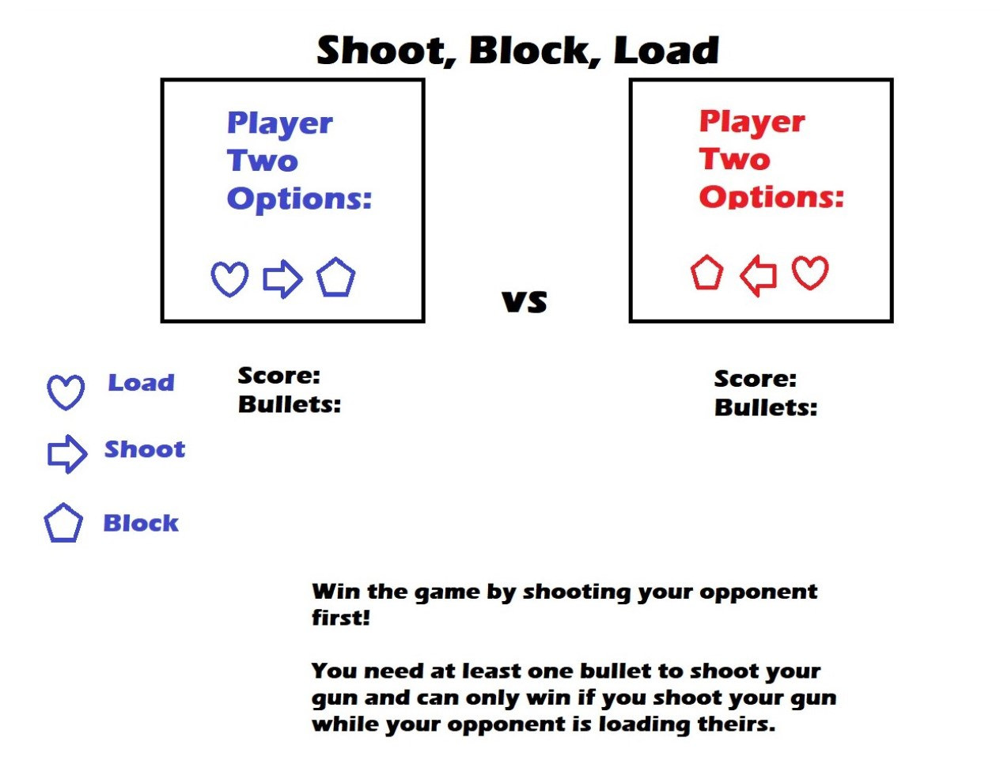

# **CHARGE, BLOCK, ZAP**

## **How To Play Charge, Block, Zap**

You have three options to choose from:
 
_Charge_ - charges your raygun  
_Block_ - sheilds zaps from alien  
_Zap_ - zaps the ailen  
 

Zap the alien before it zaps you!

1. You can charge up, zap attack, or block
2. You can only fire a ray gun if you have a charge
3. Don't get zapped while you're charging up or you'll get a damage point
4. Give the alien 5 damage points and you win!

## BEST OF LUCK SPACE EXPORER

 

## **WireFrame:**

\*changes to icons, game play, and wording made to make the game less violent

---

## **Technologies Used:**

    - HTML5      - JAVASCRIPT
    - JSX        - REACT
    - CSS        - AUTH0

---

## **Next Steps**

- add sound effects to each button click
- keep track of games won, not just rounds won
- add two player feature
  - player1 vs player2 not just player1 vs alien
- add timer to player game, enforcing quick decisions
  - will automatically choose most vulnerable play (charge) if you exceed time limit
- add more styling to make app more visually stimulating
- when a winner is declares, game should restart
