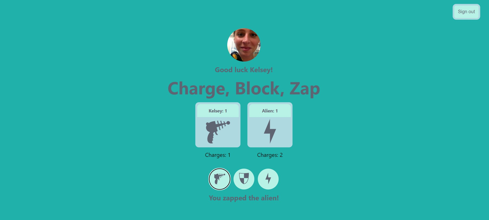

https://kelseyrocco.github.io/shoot-block-load-game/

# **How To Play Load, Block, Shoot**

You have three options to choose from:
 
**Load** - loads your gun  
**Block** - sheilds shots fired at you  
**Shoot** - shoots at your opponent  
 

You must **LOAD** bullets in your gun before you can shoot.

You can **BLOCK** incoming shots by using the sheild.

**SHOOT** your opponent before they shoot you!
  

# GOOD LUCK!

## **WireFrame:**

---

## **Technologies Used:**

    - HTML5      - JAVASCRIPT
    - JSX        - REACT
    - CSS        - AUTH0

---

## **Next Steps**

- add sound effects to each button click
- keep track of games won, not just rounds won
- add two player feature
  - player1 vs player2 not just player1 vs computer
- add timer to player game, enforcing quick decisions
  - will automatically choose most vulnerable play (load) if you exceed time limit
- add more styling to make app more visually stimulating
